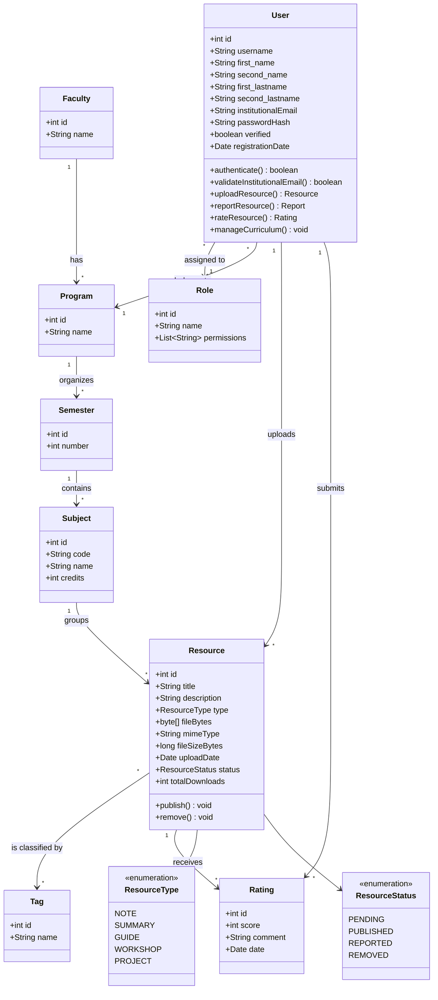
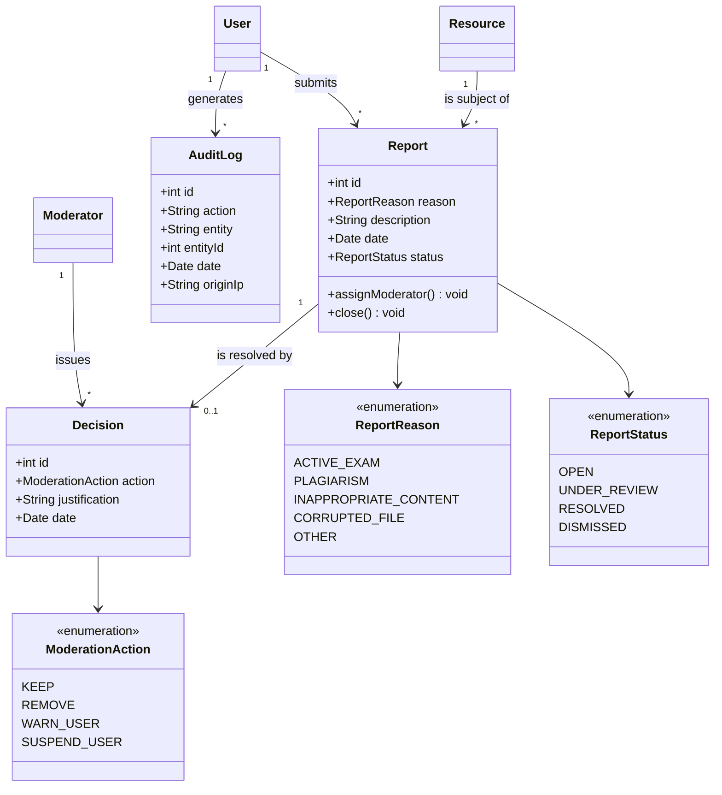
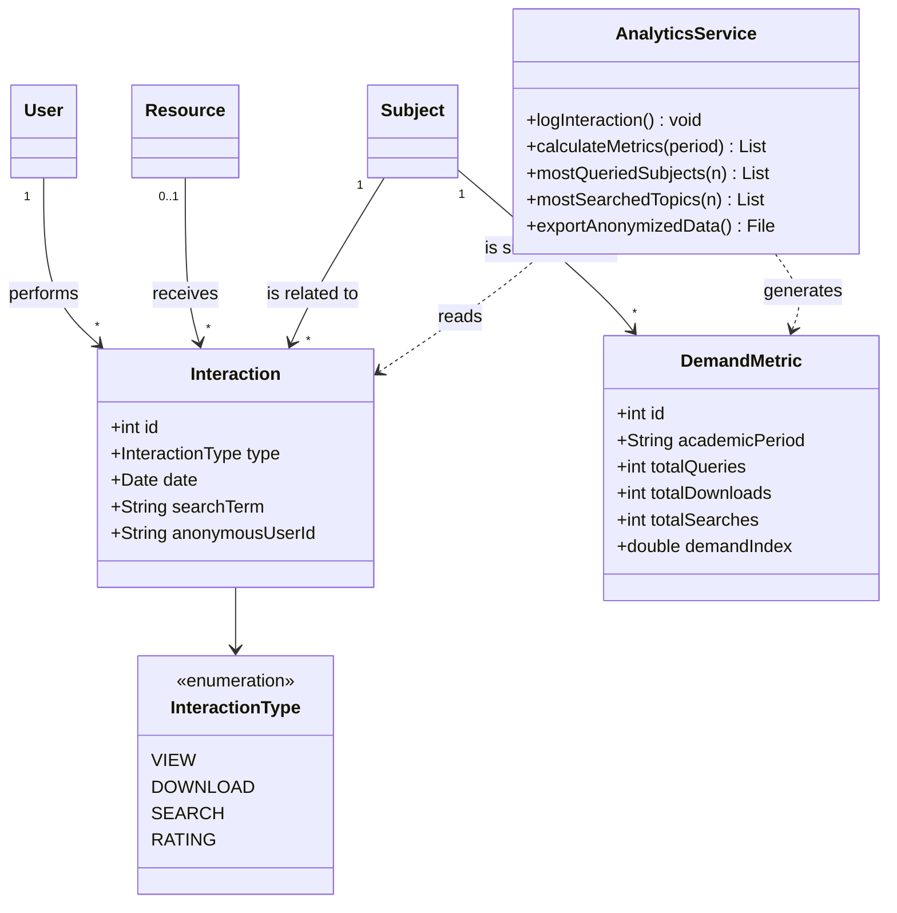

# Class Diagram

```mermaid
classDiagram
    class Faculty {
        +int id
        +String name
    }
    class Program {
        +int id
        +String name
    }
    class Semester {
        +int id
        +int number
    }
    class Subject {
        +int id
        +String code
        +String name
        +int credits
    }
    class Role {
        +int id
        +String name
        +List~String~ permissions
    }
    class User {
        +int id
        +String username
        +String first_name
        +String second_name
        +String first_lastname
        +String second_lastname
        +String institutionalEmail
        +String passwordHash
        +boolean verified
        +Date registrationDate
        +authenticate() boolean
        +validateInstitutionalEmail() boolean
        +uploadResource() Resource
        +reportResource() Report
        +rateResource() Rating
        +manageCurriculum() void
    }
    class Resource {
        +int id
        +String title
        +String description
        +ResourceType type
        +byte[] fileBytes
        +String mimeType
        +long fileSizeBytes
        +Date uploadDate
        +ResourceStatus status
        +int totalDownloads
        +publish() void
        +remove() void
    }
    class Tag {
        +int id
        +String name
    }
    class Rating {
        +int id
        +int score
        +String comment
        +Date date
    }
    class ResourceType {
        <<enumeration>>
        NOTE
        SUMMARY
        GUIDE
        WORKSHOP
        PROJECT
    }
    class ResourceStatus {
        <<enumeration>>
        PENDING
        PUBLISHED
        REPORTED
        REMOVED
    }

    Faculty "1" --> "*" Program : has
    Program "1" --> "*" Semester : organizes
    Semester "1" --> "*" Subject : contains

    User "*" --> "1" Role : assigned to
    User "*" --> "1" Program : belongs to

    User "1" --> "*" Resource : uploads
    Subject "1" --> "*" Resource : groups
    Resource "*" --> "*" Tag : is classified by
    Resource "1" --> "*" Rating : receives
    User "1" --> "*" Rating : submits

    Resource --> ResourceType
    Resource --> ResourceStatus
```

# Moderation and Auditing

```mermaid
classDiagram
    class Report {
        +int id
        +ReportReason reason
        +String description
        +Date date
        +ReportStatus status
        +assignModerator() void
        +close() void
    }
    class Decision {
        +int id
        +ModerationAction action
        +String justification
        +Date date
    }
    class AuditLog {
        +int id
        +String action
        +String entity
        +int entityId
        +Date date
        +String originIp
    }
    class ReportReason {
        <<enumeration>>
        ACTIVE_EXAM
        PLAGIARISM
        INAPPROPRIATE_CONTENT
        CORRUPTED_FILE
        OTHER
    }
    class ReportStatus {
        <<enumeration>>
        OPEN
        UNDER_REVIEW
        RESOLVED
        DISMISSED
    }
    class ModerationAction {
        <<enumeration>>
        KEEP
        REMOVE
        WARN_USER
        SUSPEND_USER
    }
    class User
    class Moderator
    class Resource

    User "1" --> "*" Report : submits
    Resource "1" --> "*" Report : is subject of
    Moderator "1" --> "*" Decision : issues
    Report "1" --> "0..1" Decision : is resolved by
    User "1" --> "*" AuditLog : generates
    Report --> ReportReason
    Report --> ReportStatus
    Decision --> ModerationAction
```

# Learning Analytics

```mermaid
classDiagram
    class Interaction {
        +int id
        +InteractionType type
        +Date date
        +String searchTerm
        +String anonymousUserId
    }
    class DemandMetric {
        +int id
        +String academicPeriod
        +int totalQueries
        +int totalDownloads
        +int totalSearches
        +double demandIndex
    }
    class AnalyticsService {
        +logInteraction() void
        +calculateMetrics(period) List
        +mostQueriedSubjects(n) List
        +mostSearchedTopics(n) List
        +exportAnonymizedData() File
    }
    class InteractionType {
        <<enumeration>>
        VIEW
        DOWNLOAD
        SEARCH
        RATING
    }
    class User
    class Resource
    class Subject

    User "1" --> "*" Interaction : performs
    Resource "0..1" --> "*" Interaction : receives
    Subject "1" --> "*" Interaction : is related to
    Subject "1" --> "*" DemandMetric : is summarized in
    AnalyticsService ..> Interaction : reads
    AnalyticsService ..> DemandMetric : generates
    Interaction --> InteractionType
```