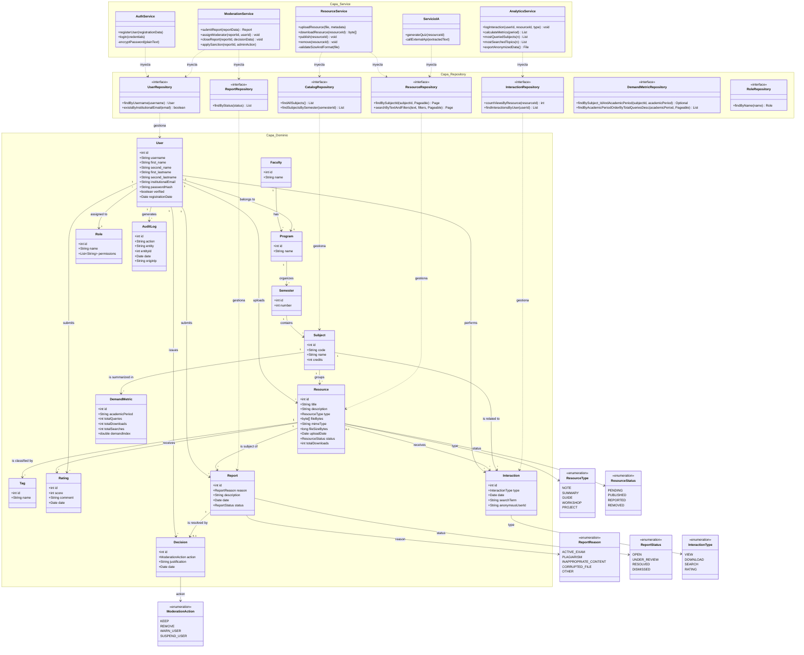

# classDiagram

```mermaid
classDiagram
    %% ==========================================
    %% CAPA TRANSVERSAL (ENUMERADORES)
    %% ==========================================
    class ResourceType {
    <<enumeration>>
    NOTE
    SUMMARY
    GUIDE
    WORKSHOP
    PROJECT
    }
    class ResourceStatus {
    <<enumeration>>
    PENDING
    PUBLISHED
    REPORTED
    REMOVED
    }
    class ReportReason {
    <<enumeration>>
    ACTIVE_EXAM
    PLAGIARISM
    INAPPROPRIATE_CONTENT
    CORRUPTED_FILE
    OTHER
    }
    class ReportStatus {
    <<enumeration>>
    OPEN
    UNDER_REVIEW
    RESOLVED
    DISMISSED
    }   
    class ModerationAction {
    <<enumeration>>
    KEEP
    REMOVE
    WARN_USER
    SUSPEND_USER
    }
    class InteractionType {
    <<enumeration>>
    VIEW
    DOWNLOAD
    SEARCH
    RATING
    }


    %% ==========================================
    %% CAPA DE DOMINIO (ENTIDADES JPA)
    %% ==========================================
    namespace Capa_Dominio {
        class Faculty {
            +int id
            +String name
        }
        class Program {
            +int id
            +String name
        }
        class Semester {
            +int id
            +int number
        }
        class Subject {
            +int id
            +String code
            +String name
            +int credits
        }
        class Role {
            +int id
            +String name
            +List~String~ permissions
        }
        class User {
            +int id
            +String username
            +String first_name
            +String second_name
            +String first_lastname
            +String second_lastname
            +String institutionalEmail
            +String passwordHash
            +boolean verified
            +Date registrationDate
        }
        class Resource {
            +int id
            +String title
            +String description
            +ResourceType type
            +byte[] fileBytes
            +String mimeType
            +long fileSizeBytes
            +Date uploadDate
            +ResourceStatus status
            +int totalDownloads
        }
        class Tag {
            +int id
            +String name
        }
        class Rating {
            +int id
            +int score
            +String comment
            +Date date
        }
        class Report {
            +int id
            +ReportReason reason
            +String description
            +Date date
            +ReportStatus status
        }
        class Decision {
            +int id
            +ModerationAction action
            +String justification
            +Date date
        }
        class AuditLog {
            +int id
            +String action
            +String entity
            +int entityId
            +Date date
            +String originIp
        }
        class Interaction {
            +int id
            +InteractionType type
            +Date date
            +String searchTerm
            +String anonymousUserId
        }
        class DemandMetric {
            +int id
            +String academicPeriod
            +int totalQueries
            +int totalDownloads
            +int totalSearches
            +double demandIndex
        }
    }
%% Relaciones estructurales del Dominio
    Faculty "1" --> "*" Program : has
    Program "1" --> "*" Semester : organizes
    Semester "1" --> "*" Subject : contains

    User "*" --> "1" Role : assigned to
    User "*" --> "1" Program : belongs to

    User "1" --> "*" Resource : uploads
    Subject "1" --> "*" Resource : groups
    Resource "*" --> "*" Tag : is classified by
    Resource "1" --> "*" Rating : receives
    User "1" --> "*" Rating : submits

    User "1" --> "*" Report : submits
    Resource "1" --> "*" Report : is subject of
    User "1" --> "*" Decision : issues
    Report "1" --> "0..1" Decision : is resolved by
    User "1" --> "*" AuditLog : generates

    User "1" --> "*" Interaction : performs
    Resource "0..1" --> "*" Interaction : receives
    Subject "1" --> "*" Interaction : is related to
    Subject "1" --> "*" DemandMetric : is summarized in

%% Relaciones hacia la Capa Transversal (uso de Enums)
    Resource --> ResourceType : type
    Resource --> ResourceStatus : status
    Report --> ReportReason : reason
    Report --> ReportStatus : status
    Decision --> ModerationAction : action
    Interaction --> InteractionType : type

    %% ==========================================
    %% CAPA DE ACCESO A DATOS (REPOSITORIOS JPA)
    %% ==========================================
    namespace Capa_Repository {
        class UserRepository {
            <<interface>>
            +findByUsername(username) User
            +existsByInstitutionalEmail(email) boolean
        }
        class ResourceRepository {
            <<interface>>
            +findBySubjectId(subjectId, Pageable) Page
            +searchByTextAndFilters(text, filters, Pageable) Page
        }
        class CatalogRepository {
            <<interface>>
            +findAllSubjects() List
            +findSubjectsBySemester(semesterId) List
        }
        class InteractionRepository {
            <<interface>>
            +countViewsByResource(resourceId) int
            +findInteractionsByUser(userId) List
        }
        class ReportRepository {
            <<interface>>
            +findByStatus(status) List
        }
        class DemandMetricRepository {
            <<interface>>
            +findBySubject_IdAndAcademicPeriod(subjectId, academicPeriod) Optional
            +findByAcademicPeriodOrderByTotalQueriesDesc(academicPeriod, Pageable) List
        }
        class RoleRepository {
            <<interface>>
            +findByName(name) Role
        }
    }
%% Relaciones: Los repositorios gestionan las entidades del dominio
    UserRepository ..> User : gestiona
    ResourceRepository ..> Resource : gestiona
    CatalogRepository ..> Subject : gestiona
    InteractionRepository ..> Interaction : gestiona
    ReportRepository ..> Report : gestiona


    %% ==========================================
    %% CAPA DE LÓGICA DE NEGOCIO (SERVICIOS)
    %% ==========================================
    namespace Capa_Service {
        class AuthService {
            +registerUser(registrationData)
            +login(credentials)
            -encryptPassword(plainText)
        }
        class ResourceService {
            +uploadResource(file, metadata)
            +downloadResource(resourceId) byte[]
            +publish(resourceId) void
            +remove(resourceId) void
            -validateSizeAndFormat(file)
        }
        class AnalyticsService {
            +logInteraction(userId, resourceId, type) void
            +calculateMetrics(period) List
            +mostQueriedSubjects(n) List
            +mostSearchedTopics(n) List
            +exportAnonymizedData() File
        }
        class ModerationService {
            +submitReport(reportData) Report
            +assignModerator(reportId, userId) void
            +closeReport(reportId, decisionData) void
            +applySanction(reportId, adminAction)
        }
        class ServicioIA {
            +generateQuiz(resourceId)
            -callExternalApi(extractedText)
        }
    }

%% Relaciones: Los servicios inyectan y utilizan los repositorios
    AuthService ..> UserRepository : inyecta

    ResourceService ..> ResourceRepository : inyecta
    ResourceService ..> CatalogRepository : inyecta

    AnalyticsService ..> InteractionRepository : inyecta

    ModerationService ..> ReportRepository : inyecta
    ModerationService ..> UserRepository : inyecta

    ServicioIA ..> ResourceRepository : inyecta
```
