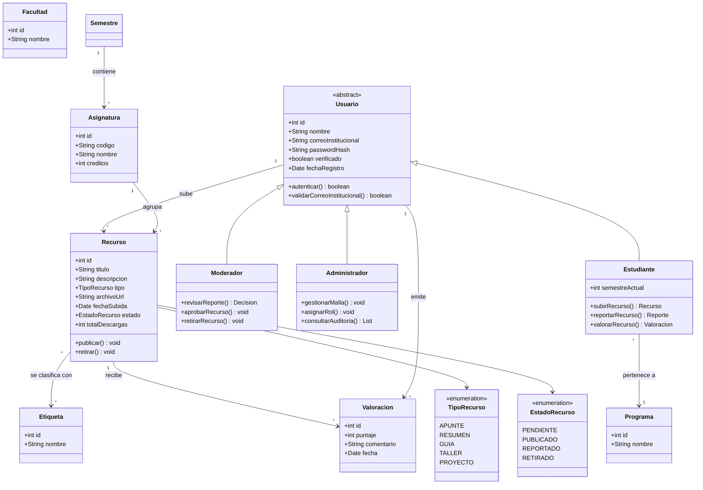
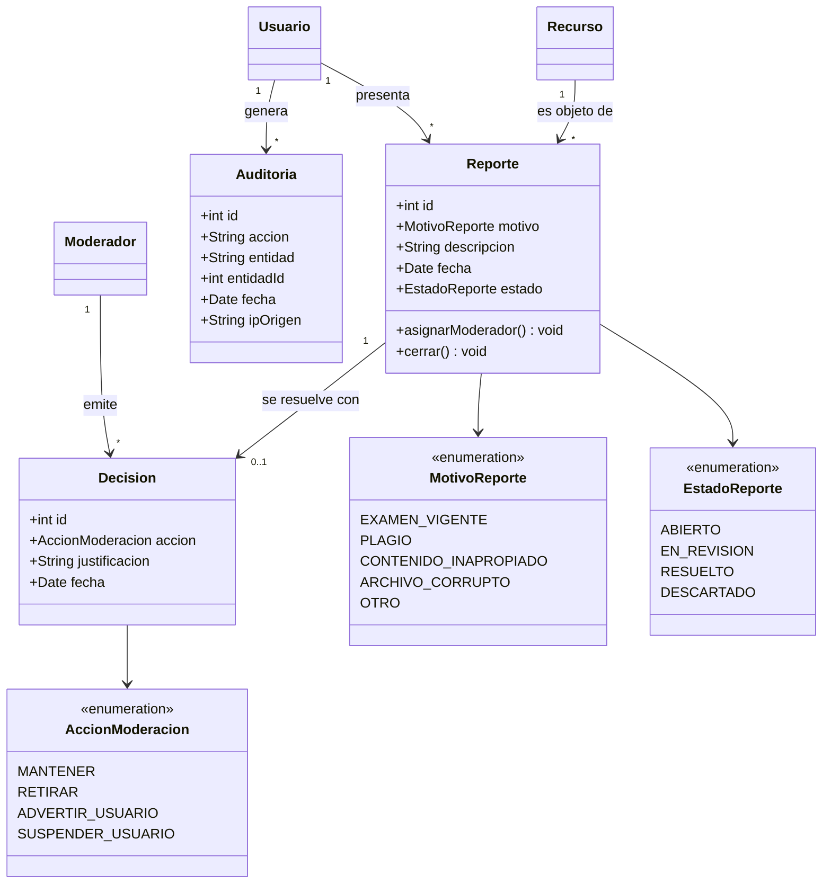
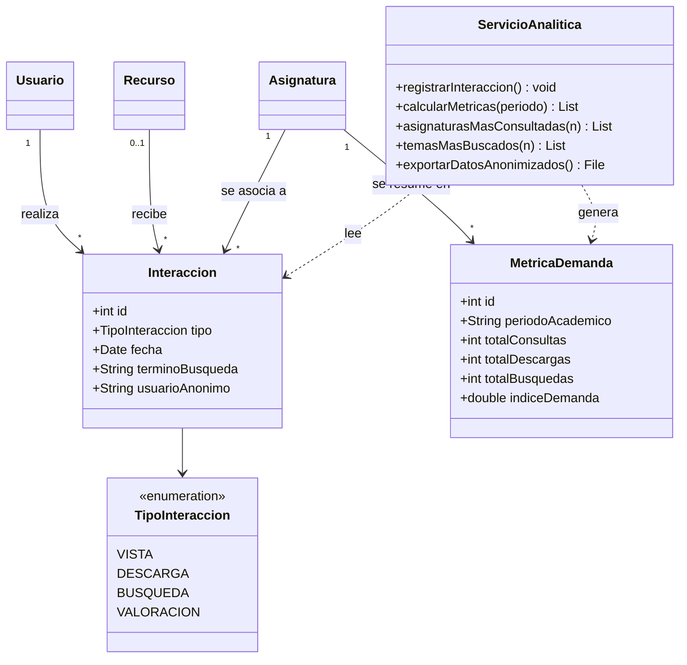

# Class Diagram

```mermaid
classDiagram
    class Facultad {
+int id
+String nombre }

    class Programa {
+int id
+String nombre
}
class Asignatura {
        +int id
        +String codigo
        +String nombre
        +int creditos
    }
    class Usuario {
        <<abstract>>
        +int id
        +String nombre
        +String correoInstitucional
        +String passwordHash
        +boolean verificado
        +Date fechaRegistro
        +autenticar() boolean
        +validarCorreoInstitucional() boolean
    }
    class Estudiante {
        +int semestreActual
        +subirRecurso() Recurso
        +reportarRecurso() Reporte
        +valorarRecurso() Valoracion
    }
    class Moderador {
+revisarReporte() Decision
+aprobarRecurso() void
+retirarRecurso() void
}
    class Administrador {
        +gestionarMalla() void
        +asignarRol() void
        +consultarAuditoria() List
    }
    class Recurso {
        +int id
        +String titulo
        +String descripcion
        +TipoRecurso tipo
        +String archivoUrl
        +Date fechaSubida
        +EstadoRecurso estado
        +int totalDescargas
        +publicar() void
        +retirar() void
    }
    class Etiqueta {
        +int id
        +String nombre
    }
    class Valoracion {
        +int id
        +int puntaje
        +String comentario
        +Date fecha
    }
    class TipoRecurso {
        <<enumeration>>
        APUNTE
        RESUMEN
        GUIA
        TALLER
        PROYECTO
    }

    class EstadoRecurso {
        <<enumeration>>
        PENDIENTE
        PUBLICADO
        REPORTADO
        RETIRADO
    }

    Semestre "1" --> "*" Asignatura : contiene
    Usuario <|-- Estudiante
    Usuario <|-- Moderador
    Usuario <|-- Administrador
    Estudiante "*" --> "1" Programa : pertenece a
    Usuario "1" --> "*" Recurso : sube
    Asignatura "1" --> "*" Recurso : agrupa
    Recurso "*" --> "*" Etiqueta : se clasifica con
    Recurso "1" --> "*" Valoracion : recibe
    Usuario "1" --> "*" Valoracion : emite
    Recurso --> TipoRecurso
    Recurso --> EstadoRecurso

```
# Modeling and Auditing

```mermaid
classDiagram
class Reporte {
+int id
+MotivoReporte motivo
+String descripcion
+Date fecha
+EstadoReporte estado
+asignarModerador() void
+cerrar() void
}
class Decision {
+int id
+AccionModeracion accion
+String justificacion
+Date fecha
}
class Auditoria {
+int id
+String accion
+String entidad
+int entidadId
+Date fecha
+String ipOrigen
}
class MotivoReporte {
<<enumeration>>
EXAMEN_VIGENTE
PLAGIO
CONTENIDO_INAPROPIADO
ARCHIVO_CORRUPTO
OTRO
}
class EstadoReporte {
<<enumeration>>
ABIERTO
EN_REVISION
RESUELTO
DESCARTADO
}
class AccionModeracion {
<<enumeration>>
MANTENER
RETIRAR
ADVERTIR_USUARIO
SUSPENDER_USUARIO
}
class Usuario
class Moderador
class Recurso
Usuario "1" --> "*" Reporte : presenta
Recurso "1" --> "*" Reporte : es objeto de
Moderador "1" --> "*" Decision : emite
Reporte "1" --> "0..1" Decision : se resuelve con
Usuario "1" --> "*" Auditoria : genera
Reporte --> MotivoReporte
Reporte --> EstadoReporte
Decision --> AccionModeracion
```
#  Learning Analytics

```mermaid
classDiagram
class Interaccion {
+int id
+TipoInteraccion tipo
+Date fecha
+String terminoBusqueda
+String usuarioAnonimo
}
class MetricaDemanda {
+int id
+String periodoAcademico
+int totalConsultas
+int totalDescargas
+int totalBusquedas
+double indiceDemanda
}
class ServicioAnalitica {
+registrarInteraccion() void
+calcularMetricas(periodo) List
+asignaturasMasConsultadas(n) List
+temasMasBuscados(n) List
+exportarDatosAnonimizados() File
}
class TipoInteraccion {
<<enumeration>>
VISTA
DESCARGA
BUSQUEDA
VALORACION
}
class Usuario
class Recurso
class Asignatura
Usuario "1" --> "*" Interaccion : realiza
Recurso "0..1" --> "*" Interaccion : recibe
Asignatura "1" --> "*" Interaccion : se asocia a
Asignatura "1" --> "*" MetricaDemanda : se resume en
ServicioAnalitica ..> Interaccion : lee
ServicioAnalitica ..> MetricaDemanda : genera
Interaccion --> TipoInteraccion
```