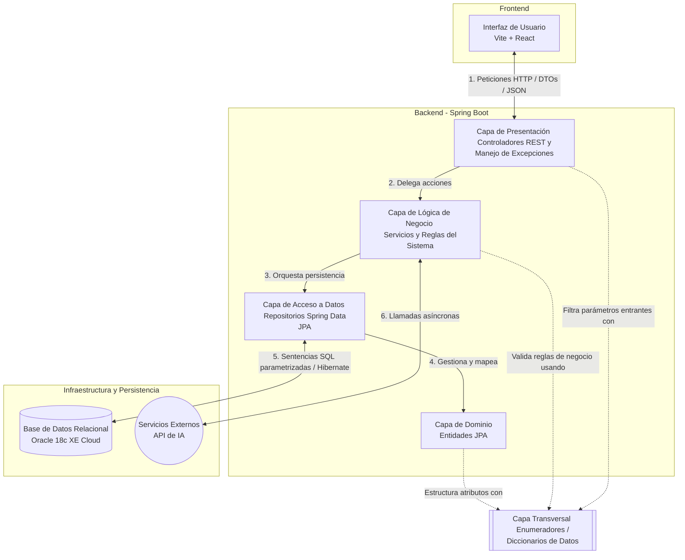

# laysDiagram

```mermaid
flowchart TD
%% ==========================================
%% CLIENTE
%% ==========================================
subgraph Capa_Cliente [Frontend]
UI[Interfaz de Usuario \n Vite + React]
end

    %% ==========================================
    %% BACKEND - SPRING BOOT
    %% ==========================================
    subgraph Capa_Backend [Backend - Spring Boot]
        direction TB
        Presentacion[Capa de Presentación \n Controladores REST y Manejo de Excepciones]
        Servicios[Capa de Lógica de Negocio \n Servicios y Reglas del Sistema]
        Repositorios[Capa de Acceso a Datos \n Repositorios Spring Data JPA]
        Dominio[Capa de Dominio \n Entidades JPA]
    end

    %% ==========================================
    %% CAPA TRANSVERSAL
    %% ==========================================
    Transversal[[Capa Transversal \n Enumeradores / Diccionarios de Datos]]

    %% ==========================================
    %% INFRAESTRUCTURA
    %% ==========================================
    subgraph Capa_Infraestructura [Infraestructura y Persistencia]
        BD[(Base de Datos Relacional \n Oracle 18c XE Cloud)]
        IA((Servicios Externos \n API de IA))
    end

    %% ==========================================
    %% FLUJO DE COMUNICACIÓN (RELACIONES)
    %% ==========================================
    
    %% Flujo principal
    UI <-->|1. Peticiones HTTP / DTOs / JSON| Presentacion
    Presentacion -->|2. Delega acciones| Servicios
    Servicios -->|3. Orquesta persistencia| Repositorios
    Repositorios -->|4. Gestiona y mapea| Dominio
    
    %% Conexiones de infraestructura
    Repositorios <-->|5. Sentencias SQL parametrizadas / Hibernate| BD
    Servicios <-->|6. Llamadas asíncronas| IA
    
    %% Consumo transversal
    Dominio -.->|Estructura atributos con| Transversal
    Servicios -.->|Valida reglas de negocio usando| Transversal
    Presentacion -.->|Filtra parámetros entrantes con| Transversal
```